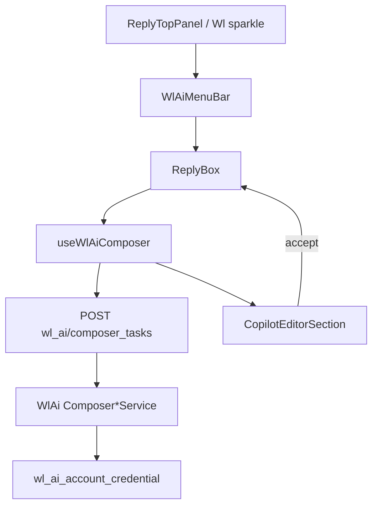

# Customizations

Este documento registra todas as customizações aplicadas neste fork sobre o
upstream do Chatwoot (`https://github.com/chatwoot/chatwoot`). É a memória
institucional usada em cada sync com upstream — antes de aceitar um merge,
verifique esta lista e confirme que nada quebrou.

## Estrutura de remotes

- `origin` → `git@github.com:fss6/chatwoot.git` (este fork; branch principal `main`)
- `upstream` → `https://github.com/chatwoot/chatwoot.git` (oficial; branch base `develop`)

A branch `main` deste fork é derivada de `upstream/develop`. Todo trabalho
white-label vive em `main` (ou em feature branches que mesclam em `main`).

## Sync com upstream

Feito manualmente pela UI do GitHub (botão "Sync fork" no `fss6/chatwoot`).
Quando o sync trouxer commits novos, criar localmente uma branch a partir de
`origin/main` atualizado e abrir PR para revisão.

Sequência recomendada localmente:

```
git fetch origin
git checkout -b sync/<data> origin/main
# resolver conflitos (rerere ajuda — já habilitado neste clone)
git push origin sync/<data>
```

Antes de mesclar:

1. Conferir conflitos (rerere lembra resoluções anteriores).
2. Rodar a suíte: `pnpm eslint && pnpm test && bundle exec rubocop && bundle exec rspec`.
3. Smoke test manual em staging: login, conversa, widget, portal.
4. Conferir que esta lista (`CUSTOMIZATIONS.md`) continua coerente.

## Convenções

- Customizações **novas** moram em arquivos novos (ex.: `app/javascript/dashboard/custom/`,
  `*_brand-overrides.scss`) para minimizar área de conflito.
- Quando precisar editar um arquivo do upstream, mantenha a edição **cirúrgica**:
  uma linha de `@import`, uma troca de paleta, etc.
- Em strings de marca, prefira o composable `useBranding.replaceInstallationName`
  em vez de hardcodar marca nova nos JSONs de i18n.
- i18n: editar apenas `en.yml` e `en.json`. Outros idiomas via overlay próprio
  para não brigar com o Crowdin do upstream.

## Customizações ativas

> Esta seção é atualizada a cada PR de customização. Use a tabela como índice.

| Categoria | Arquivos tocados | Tipo | Motivo |
|---|---|---|---|
| Brand overrides (dashboard) | `app/javascript/dashboard/assets/scss/_brand-overrides.scss` | NEW | Indigo em `--blue-*`; tokens de **superfície** (`--background-color`, `--surface-*`, `--border-*`, `--card-color`, `--solid-*`) para mais contraste canvas/cards; `@import` de `sidebar-theme`, `content-theme` e `conversation-theme`. |
| Brand overrides (dashboard wiring) | `app/javascript/dashboard/assets/scss/_woot.scss` | PATCH | Adicionada 1 linha `@import 'brand-overrides';` após `next-colors`. |
| Brand overrides (widget) | `app/javascript/widget/assets/scss/_brand-overrides.scss` | NEW | Mesma paleta indigo do dashboard para coerência entre superfícies. |
| Brand overrides (widget wiring) | `app/javascript/widget/assets/scss/woot.scss` | PATCH | Adicionada 1 linha `@import 'brand-overrides';` no fim do arquivo, depois das definições embutidas de `:root`/`.dark`. |
| Brand token (`bg-n-brand`) | `theme/colors.js` | PATCH | 1 linha: `brand: '#2781F6'` → `brand: 'rgb(var(--blue-9) / <alpha-value>)'`. Decoupla o token do hex Chatwoot e faz `bg-n-brand` seguir a paleta de `--blue-*` definida no fork. |
| Brand overrides (portal) | `app/javascript/portal/_brand-overrides.scss` | NEW | Reservado para overrides globais do help center (vazio por enquanto; portal usa cor por instância via `@portal.color`). |
| Brand overrides (portal wiring) | `app/javascript/portal/application.scss` | PATCH | Adicionada 1 linha `@import 'brand-overrides';` ao final. |
| Pre-commit hook | `.husky/pre-commit` | PATCH | Roda `./node_modules/.bin/lint-staged` localmente em vez de `npx --no-install`, com fallback para `pnpm exec`. Evita o erro "missing packages: lint-staged" quando `node_modules` foi instalado só no container. |
| lint-staged config | `package.json` | PATCH | Removida a entrada `*.scss: [scss-lint]` (ferramenta não existe mais no projeto — gem `scss_lint` não está no `Gemfile`) e removido o `git add` redundante de `app/**/*.{js,vue}` (lint-staged moderno já comita automaticamente). |
| Sidebar config (white-label) | `app/javascript/dashboard/custom/sidebar/sidebarConfig.js` | NEW | Define `hiddenTopLevel`, `hiddenChildren` (subitens por grupo), `sections` (rótulos por categoria), `order`, `theme` (`upstream` / `contrast` / `accent`) e `useTopBar`. Default atual: `theme: 'contrast'`, `useTopBar: true` — shell escuro permanente. |
| Sidebar filter helper | `app/javascript/dashboard/custom/sidebar/filterSidebarMenu.js` | NEW | Aplica `sidebarConfig` sobre o array de `menuItems`: filtra topo/filhos, ordena por seção e injeta `dataSectionStart` no primeiro item de cada seção. |
| Sidebar theme | `app/javascript/dashboard/custom/sidebar/_sidebar-theme.scss` | NEW | Regras CSS: (1) pill nos rótulos de seção via `[data-section-start]::before`; (2) estado ativo com tint indigo + barra lateral (`nav .bg-n-alpha-2`); (3) tema `contrast` (shell escuro); (4) tema `accent`; (5) alinhamento do dropdown da conta no topbar (`.wl-account-switcher`). |
| Sidebar wiring | `app/javascript/dashboard/components-next/sidebar/Sidebar.vue` | PATCH | Edição cirúrgica: 2 imports do fork + variáveis `wlSidebarThemeClass`/`wlUseTopBar`; troca `return [` por `const items = [` no `computed menuItems`; `return filterSidebarMenu(items);` antes do `});`; injeta `wlSidebarThemeClass` no `:class` do `<aside>`; adiciona 1 `<template v-if="wlUseTopBar">` no header da sidebar e 1 `v-if="!wlUseTopBar"` no row de search+compose para esconde-los quando o topbar custom assume. Conflito em sync apenas se o upstream reescrever o `<aside>` ou o `menuItems`. |
| Sidebar theme wiring | `app/javascript/dashboard/assets/scss/_brand-overrides.scss` | PATCH | Importa `sidebar-theme`, `content-theme` e `conversation-theme` após o `@layer base` de cores. |
| Conteúdo interno (canvas) | `app/javascript/dashboard/custom/content/_content-theme.scss` | NEW | Gradiente + `box-shadow` interno em `main.wl-content` (área principal do dashboard). |
| Conversas (lista + painel + bolhas + composer) | `app/javascript/dashboard/custom/conversation/_conversation-theme.scss` | NEW | Elevação via `box-shadow` em `.conversations-list-wrap`, `.conversation-details-wrap`, `.conversation-panel`, bolhas `.left-bubble`/`.right-bubble`, `.reply-box`; hover nas linhas `.conversation` da lista; seletores RTL com `#app[dir='rtl']` + `.dark #app[dir='rtl']`. |
| Tailwind shadows (fork) | `tailwind.config.js` | PATCH | `theme.extend.boxShadow` — `sm`/`md`/`lg`/`xl`/`2xl`/`inner`/`DEFAULT` mais marcados que o default Tailwind (afeta componentes com `shadow-*`). |
| Topbar custom (white-label) | `app/javascript/dashboard/custom/topbar/WlTopBar.vue` | NEW | Topbar acima do `<main>` com search + ComposeConversation + `SidebarAccountSwitcher`. Wrapper `.wl-account-switcher` marca o switcher para alinhar o dropdown à direita via CSS. Classe `wl-topbar--contrast` no `<header>`. |
| Account switcher dropdown align (CSS) | `app/javascript/dashboard/custom/sidebar/_sidebar-theme.scss` | NEW (regra) | Posiciona as duas camadas absolutas aninhadas do `DropdownContainer` ao `inset-inline-end: 0` dentro de `.wl-account-switcher`. Zero patch upstream. |
| Topbar mounting | `app/javascript/dashboard/routes/dashboard/Dashboard.vue` | PATCH | Importa `WlTopBar` + `sidebarConfig`; expõe `wlUseTopBar` no setup; envolve `<main>` num wrapper coluna (`flex flex-col flex-1`) com `<WlTopBar v-if="wlUseTopBar" />` no topo; `<main>` com classe `wl-content`. |
| WL AI — auto-reply na inbox | `config/initializers/wl_ai_message_hooks.rb` | NEW | `to_prepare`: `prepend` idempotente em `MessageTemplates::HookExecutionService`, `Message` e `Inbox`. Não edita `enterprise/.../hook_execution_service.rb` nem o ficheiro OSS do hook. |
| WL AI — serviços e job | `app/services/wl_ai/message_templates/hook_extension.rb`, `conversation_reply_service.rb`, `assistant_prompt_builder.rb`, `message_extension.rb`, `inbox_active_bot_extension.rb`, `app/jobs/wl_ai/incoming_reply_job.rb` | NEW | Opt-in `WL_AI_AUTO_REPLY=true`; Captain EE tem precedência se `captain_active?`; ignora agent bot / Dialogflow; resposta LLM + mensagem outgoing com `sender: WlAiAssistant`. |
| WL AI — concern Inbox | `app/models/concerns/wl_ai/inbox_association.rb`, `app/models/inbox.rb` | NEW + PATCH | Associações `wl_ai_assistant` no concern; `include WlAi::InboxAssociation` no `Inbox`. |
| WL AI — sender API | `app/models/wl_ai_assistant.rb` | PATCH | `push_event_data` / `webhook_data`. |
| WL AI — i18n atividade | `config/locales/en.yml` | PATCH | `conversations.activity.wl_ai.auto_opened_after_agent_reply`. |
| WL AI — spec | `spec/services/wl_ai/message_templates_hook_integration_spec.rb` | NEW | Enfileiramento do job com env ligado/desligado. |
| WL AI — handoff para humano | `app/jobs/wl_ai/bot_handoff_job.rb`, `app/services/wl_ai/human_transfer_intent_detector.rb`, `app/services/wl_ai/message_templates/hook_extension.rb`, `app/services/wl_ai/conversation_reply_service.rb`, `app/services/wl_ai/assistant_prompt_builder.rb`, `app/controllers/api/v1/accounts/wl_ai/assistants_controller.rb`, `config/locales/en.yml` | NEW + PATCH | `BotHandoffJob`: nota privada opcional, mensagem pública, `bot_handoff!`, OOO. Gatilho por keywords (`transfer_keywords` / defaults i18n) antes do LLM; `llm_handoff_enabled` + resposta JSON para handoff via LLM. API `config` alargada. |
| WL AI — handoff specs | `spec/jobs/wl_ai/bot_handoff_job_spec.rb`, `spec/services/wl_ai/human_transfer_intent_detector_spec.rb`, `spec/services/wl_ai/conversation_reply_service_spec.rb`, `spec/services/wl_ai/message_templates_hook_integration_spec.rb` | NEW + PATCH | Cobertura job, detector, reply JSON, hook keyword vs reply. |
| Composer AI config | `app/javascript/dashboard/custom/composer/composerConfig.js` | NEW | `useWlAiComposer: true`, `useCaptainTasks: false` — gate do menu sparkle. |
| WL AI — composer backend | `app/services/wl_ai/composer_*_service.rb`, `composer_tasks_controller.rb`, `lib/wl_ai/prompts/*.liquid`, `config/routes.rb` | NEW + PATCH | `POST …/wl_ai/composer/{reply_suggestion,summarize,rewrite}`; credencial `wl_ai_account_credential`; assistente da inbox ou primeiro da conta. |
| WL AI — composer frontend | `custom/composer/WlAiMenuBar.vue`, `composables/useWlAiComposer.js`, `useComposerAssist.js`, `api/wlAi/composerTasks.js`, `i18n/en/wlAi.json` | NEW | Menu sparkle + preview (`CopilotEditorSection` via `ReplyBox`); “Open playground” → rota `wl_ai_playground_pick`. |
| WL AI — composer wiring | `ReplyTopPanel.vue`, `ReplyBox.vue`, `Editor.vue` | PATCH | Patches cirúrgicos: menu Wl AI vs Captain Tasks conforme `composerConfig`. |

### Tipos

- **NEW** — arquivo criado neste fork. Zero conflito esperado em sync.
- **PATCH** — edição cirúrgica em arquivo do upstream. Conflito possível.
- **WRAP** — wrapper que substitui o uso de um componente do upstream sem editá-lo.

## Tags de release

Convenção: `vX.Y.Z-fss6.N` onde `X.Y.Z` é a versão upstream de referência e
`N` é incremental por release deste fork.

- `v0.1.0-fss6.0` — baseline (Fase 0).
- `v0.1.1-fss6.0` — Fase 2 scaffold: arquivos `_brand-overrides.scss` criados em dashboard/widget/portal, prontos para receber a paleta da marca.
- `v0.1.2-fss6.0` — Fase 2 paleta Violet (Radix) aplicada em dashboard e widget. (Substituída na v0.1.5.)
- `v0.1.3-fss6.0` — Sidebar config: ponto de extensão `sidebarConfig.js` para esconder/reordenar grupos sem editar `Sidebar.vue`.
- `v0.1.4-fss6.0` — Sidebar theme: temas `contrast` e `accent` disponíveis via `sidebarConfig.theme`. (Tema default revertido em v0.1.5.)
- `v0.1.5-fss6.0` — Paleta trocada para **slate sóbria** (Linear/Vercel) em dashboard e widget; sidebar volta ao tema `upstream`. Adicionadas **seções rotuladas** (ATENDIMENTO / CRM / INSIGHTS / ADMIN) via `sidebarConfig.sections` — disposição da sidebar deixa de ser lista plana. Zero patch novo no template do upstream (usa data-attribute + CSS).
- `v0.1.6-fss6.0` — **Topbar custom** (`WlTopBar.vue`) acima do `<main>` com search + nova conversa + account switcher. Sidebar vira **nav rail pura** (logo no topo + menu + profile). Acionado por `sidebarConfig.useTopBar = true` — desligar reverte ao layout upstream sem remover código. Divider das seções ganha **barra colorida de 2px** na primária acima do label.
- `v0.1.7-fss6.0` — Paleta trocada de slate puro para **slate + indigo acento** (Linear-ish). `--blue-*` agora é Indigo Radix; `bg-n-brand` (botões primários) passa a obedecer ao fork via patch de 1 linha em `theme/colors.js`. Section pill da sidebar fica **monocromático com `inset` outline** (mais visível). Estado ativo da sidebar ganha **tint indigo + barra lateral** ("brilho" do fork) aplicado em `nav .bg-n-alpha-2` (atenção: classe exata, não substring — caso contrário casa `hover:bg-n-alpha-2` em todo item).
- `v0.1.9-fss6.0` — **Tema de conteúdo interno**: tokens de superfície/borda em `_brand-overrides.scss`; `theme.extend.boxShadow` no Tailwind (sombras mais fortes em `shadow-sm` etc.); `main.wl-content` + `_content-theme.scss` (gradiente perceptível no canvas principal).
- `v0.1.10-fss6.0` — **Tema da área de conversas**: `_conversation-theme.scss` importado em `_brand-overrides.scss` — sombras na coluna da lista, no painel de detalhe, nas bolhas e no composer (`reply-box`), com variantes dark e RTL.

## Mapa: IA no composer (`ReplyTopPanel` / menu sparkle)

Referência para white-label sem violar licença Enterprise nem aumentar conflitos
com upstream. Atualizado a partir do fluxo upstream (`captain_tasks`) vs produto
fork (`Wl AI`).

### Fluxo atual (upstream — Captain Tasks, MIT)

```
ReplyTopPanel (v-if captainTasksEnabled)
  └─ botão sparkle → CopilotMenuBar
       ├─ reply_suggestion  ─┐
       ├─ summarize         ─┼─ emit executeCopilotAction
       ├─ ask_copilot       ─┤
       └─ improve / tone…   ─┘
            ↓
ReplyBox.executeCopilotAction → useCopilotReply.execute
  ├─ ask_copilot → UI settings is_copilot_panel_open (só renderiza com isEnterprise + captain_integration)
  └─ demais → useCaptain.processEvent → POST /api/v1/accounts/:id/captain/tasks/*
            ↓
CopilotEditorSection (preview inline + follow-up + accept → ReplyBox.message)
```

| Peça | Caminho | Licença | Notas |
|------|---------|---------|-------|
| Gate UI | `useCaptain.captainTasksEnabled` → feature `captain_tasks` | MIT | Default `enabled: true` em `config/features.yml` |
| Menu | `WootWriter/CopilotMenuBar.vue` | MIT | i18n `INTEGRATION_SETTINGS.OPEN_AI.REPLY_OPTIONS.*` |
| Top panel | `WootWriter/ReplyTopPanel.vue` | MIT | Também botão maximize → `toggleEditorSize` |
| Seleção no editor | `WootWriter/Editor.vue` (popover `CopilotMenuBar`) | MIT | Mesmo evento |
| Orquestração | `composables/useCopilotReply.js` | MIT | Analytics `CAPTAIN_EVENTS.*` |
| API client | `api/captain/tasks.js` | MIT | rewrite, summarize, reply_suggestion, follow_up |
| Backend | `lib/captain/*_service.rb`, `TasksController` | MIT | EE faz `prepend` em `BaseTaskService` (quotas cloud) |
| Painel lateral | `components/copilot/CopilotContainer.vue` | EE UI | `isEnterprise` + `captain_integration` |

**Outros consumidores de `captainTasksEnabled` no dashboard** (rebrand ou desligar junto):

- `LabelSuggestion.vue` — sugestão de labels via `TasksAPI.labelSuggestion`
- `MessagesView.vue` — exibe label suggestions
- `useConversationHotKeys.js` — atalhos CMD AI assist
- `Editor.vue` — schema/menu do ProseMirror quando tasks ativo

**Estado deste fork hoje**

- Sidebar: `hiddenTopLevel: ['Captain']` — produto Captain EE escondido.
- Wl AI: rotas `custom/wl-ai/*`, API `wl_ai/*`, auto-reply na inbox (prepend hooks).
- Composer: **ainda usa upstream** `captain_tasks` + `CopilotMenuBar` se a feature estiver on.
- Wl AI **não** expõe ainda endpoints de assist ao agente no composer (só playground + auto-reply).

---

### Opção A — Recomendada: menu sparkle → **Wl AI** (produto próprio)

Substituir dependência de `/captain/tasks` no reply box por API e UX da marca, sem
tocar em `enterprise/`.

#### Comportamento alvo

| Ação no menu | Comportamento |
|--------------|---------------|
| Sugerir resposta | LLM com histórico da conversa + assistente Wl AI (inbox ou default da conta) |
| Resumir conversa | LLM resumo (nota privada ou preview no `CopilotEditorSection`) |
| Melhorar / tom / gramática | Rewrite do draft atual (opcional fase 2) |
| “Perguntar…” | Navegar para `wl_ai_playground_pick` com `conversationId` query, ou drawer próprio — **não** abrir `CopilotContainer` EE |

#### Arquivos novos (NEW — zero conflito sync)

| Arquivo | Função |
|---------|--------|
| `app/javascript/dashboard/custom/composer/WlAiMenuBar.vue` | Menu sparkle (fork de `CopilotMenuBar`, i18n `WL_AI.COMPOSER.*`) |
| `app/javascript/dashboard/composables/useWlAiComposer.js` | `execute(action, data)` espelhando `useCopilotReply` (generate, follow-up, accept) |
| `app/javascript/dashboard/api/wlAi/composerTasks.js` | Cliente HTTP |
| `app/controllers/api/v1/accounts/wl_ai/composer_tasks_controller.rb` | `reply_suggestion`, `summarize`, `rewrite`, `follow_up` |
| `app/services/wl_ai/composer_follow_up_service.rb` | Refinar resultado gerado (follow-up no mini-editor) |
| `app/services/wl_ai/composer_reply_suggestion_service.rb` | Prompt + `ConversationContextBuilder` / histórico |
| `app/services/wl_ai/composer_summarize_service.rb` | Resumo da conversa |
| `app/services/wl_ai/composer_rewrite_service.rb` | Melhorar draft (fase 2) |
| `config/locales/en.yml` + `i18n/locale/en.json` | Strings `WL_AI.COMPOSER.*` (sem “Copilot”/“Captain”) |

Reutilizar sem copiar EE:

- `WlAi::ConversationContextBuilder` (já previsto para “reply assist”)
- `wl_ai_account_credential` + `Llm::Config` (mesmo stack de `PlaygroundChatService`)
- `CopilotEditorSection.vue` + fluxo `accept` do `ReplyBox` (só trocar composable)

#### Patches cirúrgicos (PATCH)

| Arquivo | Mudança |
|---------|---------|
| `custom/composer/WlReplyTopPanel.vue` | Wrapper que importa lógica do upstream **ou** patch mínimo em `ReplyTopPanel.vue` via `v-if` fork |
| `ReplyBox.vue` | `executeCopilotAction` → `wlAiComposer.execute` quando flag fork ativa (1 branch no método) |
| `config/routes.rb` | `namespace :wl_ai { resource :composer_tasks, only: [] do post … end }` |
| `sidebarConfig.js` | Já esconde `Captain`; manter `WlAi` em ATENDIMENTO |

**Alternativa ainda mais limpa para sync:** não patchar `ReplyTopPanel.vue`; criar
`WlReplyTopPanelActions.vue` montado em `ReplyBox.vue` ao lado do painel via
`v-if="wlAiComposerEnabled"` e esconder bloco `captainTasksEnabled` do upstream com
`sidebarConfig`-style flag em `custom/composer/composerConfig.js`:

```js
export const composerConfig = {
  useWlAiComposer: true,      // menu sparkle Wl AI
  useCaptainTasks: false,     // desliga CopilotMenuBar upstream
};
```

#### Fases de implementação

| Fase | Escopo | Esforço |
|------|--------|---------|
| **A0** | `composerConfig` + esconder sparkle upstream (`useCaptainTasks: false`) | Baixo |
| **A1** | Backend `reply_suggestion` + `summarize` + API + `useWlAiComposer` + menu | Médio |
| **A2** | Reutilizar `CopilotEditorSection` + follow-up | Médio — **feito** |
| **A3** | `rewrite` / tom / gramática | Médio |
| **A4** | Atalhos (`useConversationHotKeys`) + `LabelSuggestion` Wl AI ou off | Baixo–médio |
| **A5** | “Perguntar” → playground com contexto da conversa | Baixo |

#### Licença / upstream

- Código novo em `app/` + `custom/` → MIT do fork.
- Não copiar `enterprise/lib/enterprise/captain/*`.
- Sync: conflitos só em `ReplyBox.vue` / `routes.rb` se patches forem cirúrgicos.

---

### Opção B — Híbrida: manter **`captain_tasks`** (MIT) só com rebrand

Menos trabalho imediato; menu continua ligado ao Captain upstream.

| O quê | Como |
|-------|------|
| Textos | `replaceInstallationName` nos labels do menu; chaves `en.json` só onde necessário |
| Esconder “Ask Copilot” | Fork de `CopilotMenuBar` em `custom/composer/` ou prop `hideAskCopilot` via wrapper |
| Sidebar | Manter `Captain` hidden; não confundir com tasks MIT |
| Label suggestions | Manter `LabelSuggestion.vue` ou desligar com feature flag conta |
| API key | Conta precisa OpenAI hook / `CAPTAIN_OPEN_AI_*` — independente de `wl_ai` credential |

| Prós | Contras |
|------|---------|
| Quase zero backend novo | Marca “Open AI / Copilot” no código upstream |
| Sync simples | Duas stacks de credencial (hook OpenAI vs `wl_ai_account_credential`) |
| Funciona sem Wl AI composer API | Conflito conceitual: vendes Wl AI mas composer usa Captain |

**Patches mínimos**

- `custom/composer/CopilotMenuBarFork.vue` — copia enxuta de `CopilotMenuBar.vue` sem `ask_copilot`
- `ReplyTopPanel.vue` — 1 linha import do fork (PATCH) **ou** substituir componente no `ReplyBox`
- `en.json` — overlay `WL_AI` não necessário se só `replaceInstallationName`

---

### Opção C — Enterprise licenciado (referência)

Só se o cliente tiver assinatura Chatwoot EE.

| Recurso | Requisito |
|---------|-----------|
| Painel Copilot lateral | `isEnterprise` + `captain_integration` |
| Assistants / docs search em reply | EE `ReplySuggestionService` prepend |
| Quotas cloud | `Enterprise::Captain::BaseTaskService` |

White-label: `INSTALLATION_NAME` + branding; **não** redistribuir `enterprise/`.
No fork atual, `Captain` já está em `hiddenTopLevel` — reativar só para clientes EE.

---

### Matriz de decisão

| Critério | Opção A (Wl AI) | Opção B (captain_tasks) | Opção C (EE) |
|----------|-----------------|-------------------------|--------------|
| Licença EE | Não precisa | Não precisa | Contrato |
| Marca única | Sim | Parcial | Parcial |
| Uma credencial LLM (`wl_ai`) | Sim | Não (hook + wl_ai) | Depende |
| Conflito sync | Baixo se `custom/` | Muito baixo | N/A |
| Esforço | A1–A3 médio | Baixo | Comercial |

**Recomendação do fork:** **Opção A** para o composer + manter Wl AI inbox/playground;
**Opção B** só como ponte curta (A0: `useCaptainTasks: false` até A1 pronto).

**Status (implementado):** Opção A fases A0–A3 (menu, suggest, summarize, rewrite/improve/tone). Follow-up no preview ainda não (igual Captain). Label suggestions continuam em `captain_tasks` se a feature estiver on na conta.

---

### Diagrama alvo (Opção A)



---

### Checklist pré-sync upstream

Ao mesclar `upstream/develop`, rever se estes arquivos upstream mudaram:

- [ ] `ReplyTopPanel.vue`, `CopilotMenuBar.vue`, `ReplyBox.vue`
- [ ] `useCopilotReply.js`, `useCaptain.js`
- [ ] `Editor.vue` (popover AI)
- [ ] `Sidebar.vue` (`menuItems` names: `WlAi`, `Captain`)
- [ ] `config/features.yml` (`captain_tasks`)
- [ ] `lib/captain/*` (contratos API tasks)

## Gotchas conhecidos

> Atualizar quando algum sync ensinar uma lição nova.

- (vazio por enquanto)

## Estado atual do trabalho (handoff)

### Fases concluídas

- **Fase 0 — Setup de fork e pipeline** ✓
  - Remote `origin` → `git@github.com:fss6/chatwoot.git`.
  - Remote `upstream` → `https://github.com/chatwoot/chatwoot.git`.
  - Branch `main` criada a partir de `upstream/develop` e empurrada para `origin/main`.
  - `git config rerere.enabled true` e `rerere.autoupdate true`.
  - Sync com upstream feito manualmente via UI do GitHub no fork (sem workflow dedicado).
- **Fase 2 — Sistema de cores** ✓
  - Três arquivos `_brand-overrides.scss` criados em dashboard/widget/portal e conectados via `@import` no SCSS entry de cada superfície.
  - Paleta primária aplicada: **Violet (Radix Colors)** no lugar do azul do Chatwoot, em dashboard e widget, light e dark mode.
  - Cores semânticas (`ruby`, `amber`, `teal`) mantidas para preservar leitura crítica de SLA/CSAT/erros.
  - Portal continua com paleta neutra (sem cor de marca global); cor por portal segue dinâmica via `@portal.color`.

### Pendências para o próximo bloco de trabalho

1. **Commit das mudanças** (Fases 0 + 2 scaffold). Hoje no working tree:
   - `M docker-compose.yaml` (modificação antiga, não relacionada ao white-label).
   - `M app/javascript/dashboard/assets/scss/_woot.scss`
   - `M app/javascript/portal/application.scss`
   - `M app/javascript/widget/assets/scss/woot.scss`
   - `?? CUSTOMIZATIONS.md`
   - `?? app/javascript/dashboard/assets/scss/_brand-overrides.scss`
   - `?? app/javascript/portal/_brand-overrides.scss`
   - `?? app/javascript/widget/assets/scss/_brand-overrides.scss`
   - Sugestão: commit separado para `docker-compose.yaml` (ou descartar) antes do commit do white-label.

2. **Decisão pendente sobre Sidebar (Fase 4)**: descoberta importante registrada abaixo, na seção "Descobertas". Em vez de criar um wrapper amplo, primeiro responder:
   - Quais módulos esconder no MVP (Captain? Campaigns? Help Center?).
   - Se quer reordenar/renomear grupos.
   - Se quer wrapper completo agora ou só após decidir features.

3. **Paleta a definir antes de preencher os overrides**. Pendente decisão de
   cor primária do produto. Quando decidido:
   - Preencher `--blue-9`, `--blue-10`, `--blue-11` em `_brand-overrides.scss` do dashboard (`:root` claro + `.dark` escuro).
   - Replicar no widget para coerência.
   - Se quiser substituir totalmente a paleta `woot.*` do Tailwind (ex.: para classes `bg-woot-500`), editar também `theme/colors.js`.

4. **Próximas fases não iniciadas** (ordem sugerida no plano original):
   - Fase 1 — Branding runtime (Super Admin + corrigir hardcodes em `public/manifest.json` e `app/views/layouts/vueapp.html.erb`).
   - Fase 3 — Substituir assets (logos, favicons, splash).
   - Fase 4 — Layout: wrapper de Sidebar e ajuste de help URLs.
   - Fase 5 — Widget (POWERED_BY hardcoded + auditoria).
   - Fase 6 — Help Center (auditar header + considerar `disable_branding` por padrão).
   - Fase 7 — i18n: substituir "Chatwoot" hardcoded em `en.yml` e `en.json`.

### Descobertas relevantes

A flag `isACustomBrandedInstance` em [`app/javascript/shared/store/globalConfig.js`](app/javascript/shared/store/globalConfig.js) já é `installationName !== 'Chatwoot'`. Setando `INSTALLATION_NAME` no Super Admin para qualquer coisa diferente de "Chatwoot", os itens abaixo **somem sem código**:

| Elemento | Onde |
|---|---|
| Changelog card e button da Sidebar | `app/javascript/dashboard/components-next/sidebar/Sidebar.vue` linhas 839-852 |
| Banner Year-in-Review | `app/javascript/dashboard/components-next/year-in-review/YearInReviewBanner.vue` |
| "Contact support", "Docs", "Changelog" no profile menu | `app/javascript/dashboard/components-next/sidebar/SidebarProfileMenu.vue` |
| Telas de paywall/upgrade | `app/javascript/dashboard/composables/usePolicy.js` linhas 75-77, 111-113 |
| Variações de copy/testimonials no signup | `app/javascript/v3/views/auth/signup/Index.vue` |

**Implicação:** muitos dos itens do plano original "Fase 4" são na verdade Fase 1 (configuração runtime, zero código).
